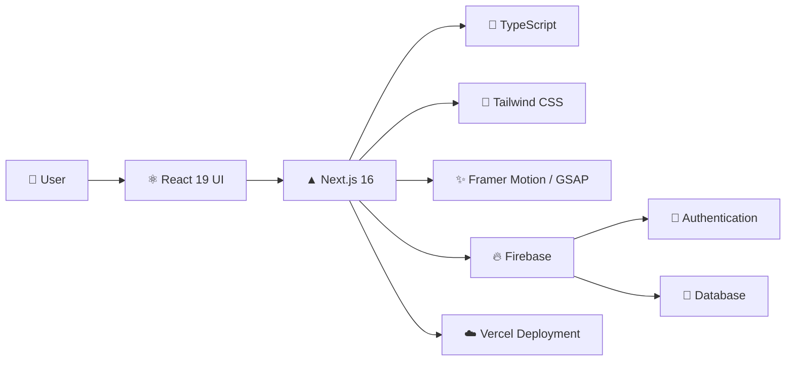
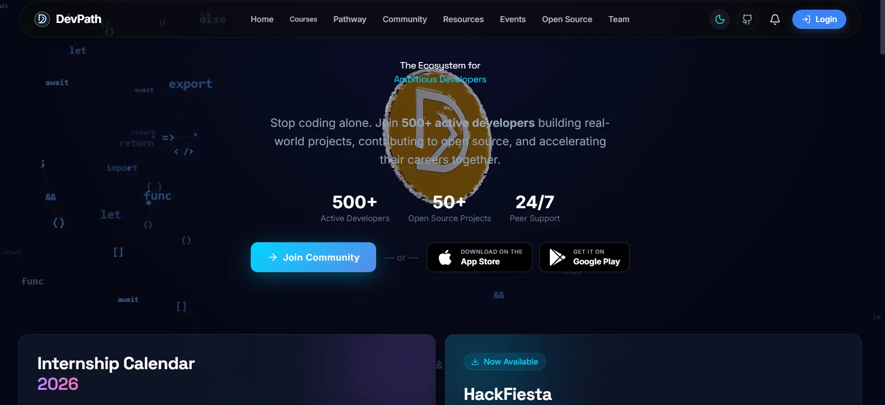
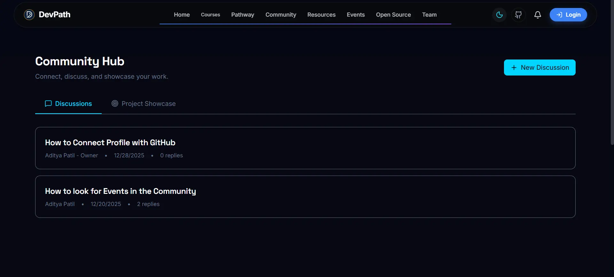

# DevPath India Community Website

<p align="center">
  
</p>

<p align="center">
<a href="https://your-site-url.com">
  
</a>
  <a href="https://github.com/devpathindcommunity-india/DevPath-Web/graphs/contributors"></a>
  <a href="https://github.com/devpathindcommunity-india/DevPath-Web/network/members"></a>
  <a href="https://github.com/devpathindcommunity-india/DevPath-Web/stargazers"></a>
  <a href="https://github.com/devpathindcommunity-india/DevPath-Web/issues"></a>
  <a href="https://github.com/devpathindcommunity-india/DevPath-Web/blob/main/LICENSE"></a>
</p>

<p align="center">
  Welcome to the official repository for the <b>DevPath India Community Website</b>. This platform is designed to foster collaboration, share resources, manage events, and connect developers within the DevPath India community. Built with the latest web technologies, it offers a modern, responsive, and interactive user experience.
</p>

<br />

---

## 📑 Table of Contents

| Section                                                           | Description                                                                |
| ----------------------------------------------------------------- | -------------------------------------------------------------------------- |
| [🚀 Features](#-features)                                         | Explore the platform's core functionality and community-focused features.  |
| [🛠️ Tech Stack](#️-tech-stack)                                   | Discover the technologies, frameworks, and services powering the platform. |
| [📂 Project Structure](#-project-structure)                       | Understand the organization and architecture of the codebase.              |
| [📸 Screenshots](#-screenshots)                                   | Preview key pages and user experiences.                                    |
| [🏁 Getting Started](#-getting-started)                           | Set up and run the project locally.                                        |
| [📋 Prerequisites](#-prerequisites)                               | Review required tools and dependencies.                                    |
| [⚡ Installation](#-installation)                                  | Follow the project installation steps.                                     |
| [🔥 Local Firebase Configuration](#-local-firebase-configuration) | Configure Firebase for local development.                                  |
| [📜 Available Scripts](#-available-scripts)                       | Reference commonly used development commands.                              |
| [🤝 Contributing](#-contributing)                                 | Learn how to contribute to the project.                                    |
| [💖 Code of Conduct](#-code-of-conduct)                           | Review community standards and expectations.                               |
| [📄 License & Brand Protection](#-license--brand-protection)      | Understand licensing terms and branding policies.                          |
| [🌟 Major Contributors](#-major-contributors)                     | Meet the contributors behind the project.                                  |

---

## 🚀 Features

* 🤝 **Community Hub** — Connect with developers, mentors, and contributors.
* 📅 **Event Management** — Discover hackathons, workshops, and community events.
* 📚 **Resource Library** — Access curated roadmaps, tutorials, and learning resources.
* 📖 **Wiki & Knowledge Base** — Explore guides, documentation, and community articles.
* 👤 **User Profiles** — Showcase your skills, achievements, and contributions.
* 🌟 **Open Source Collaboration** — Contribute to projects and grow through real-world experience.
* 📱 **Responsive Design** — Seamlessly accessible across desktop, tablet, and mobile devices.

---

## 🛠️ Tech Stack

<p align="center">
DevPath India is built using a modern, scalable, and developer-friendly technology stack designed for performance, maintainability, and an exceptional user experience.
</p>

<div align="center">

| Category | Technology |
|----------|------------|
| **Framework** | Next.js 16 (App Router) |
| **Frontend Library** | React 19 |
| **Language** | TypeScript |
| **Styling** | Tailwind CSS |
| **Animations** | Framer Motion & GSAP |
| **Icons** | Lucide React |
| **Linting & Code Quality** | ESLint |
| **Package Manager** | npm |
| **Backend Services** | Firebase |
| **Deployment** | Vercel |

</div>


---

### Architecture Overview



---

## 📁 Folder Structure

A quick overview of the project's organization to help new contributors navigate the codebase easily.

```
DevPath-Web/
├── .github/               # GitHub workflows, PR & issue templates
├── public/                # Static assets (images, icons, fonts, logo)
├── scripts/               # Utility and automation scripts
├── src/                   # Main source code
│   ├── app/               # Next.js App Router — pages, layouts & routing
│   ├── assets/            # Project assets (SVGs, illustrations)
│   ├── components/        # Reusable UI components used across pages
│   ├── config/            # App-level configuration and constants
│   ├── context/           # React Context API providers (global state)
│   ├── data/              # Static data, mock data & content constants
│   ├── hooks/             # Custom React hooks for shared logic
│   ├── lib/               # Third-party library setups (Firebase, etc.)
│   └── utils/             # Helper functions and utility methods
├── .env.example           # Environment variables template
├── .env.local             # Local environment variables (git-ignored)
├── firebase.json          # Firebase Hosting & services configuration
├── firestore.rules        # Firestore security rules
├── firestore.indexes.json # Firestore composite indexes
├── next.config.ts         # Next.js configuration
├── tailwind.config.ts     # Tailwind CSS configuration
├── tsconfig.json          # TypeScript compiler configuration
├── postcss.config.js      # PostCSS configuration
└── eslint.config.mjs      # ESLint rules and configuration
```


## 📸 Screenshots

| Home Page | Community |
| :---: | :---: |
|  |  |

---

## 📂 Project Structure

```txt id="y2rkx9"
DevPath-Web/
├── .github/               # GitHub workflows, issue templates, and PR templates
├── public/                # Static assets (images, icons, logos, fonts)
├── scripts/               # Utility scripts and automation tasks
├── src/
│   ├── app/               # Next.js App Router pages, layouts, and routes
│   ├── assets/            # SVGs, illustrations, and project assets
│   ├── components/        # Reusable UI components
│   ├── config/            # Application configuration and constants
│   ├── context/           # React Context providers and global state
│   ├── data/              # Static content, metadata, and mock data
│   ├── hooks/             # Custom React hooks
│   ├── lib/               # Firebase and third-party service integrations
│   └── utils/             # Shared helper functions and utilities
├── .env.example           # Environment variables template
├── firebase.json          # Firebase Hosting configuration
├── firestore.rules        # Firestore security rules
├── firestore.indexes.json # Firestore composite indexes
├── next.config.ts         # Next.js configuration
├── tailwind.config.ts     # Tailwind CSS configuration
├── tsconfig.json          # TypeScript configuration
├── postcss.config.js      # PostCSS configuration
└── eslint.config.mjs      # ESLint configuration
```

## 🏁 Getting Started

Get DevPath India running locally in just a few steps.

### 📋 Prerequisites

Make sure you have:

* Node.js (Latest LTS recommended)
* npm, yarn, or pnpm
* Git
* A Firebase project

---

### ⚡ Installation

1. **Clone the repository**

```bash
git clone https://github.com/devpathindcommunity-india/DevPath-Web.git
cd DevPath-Web
```

2. **Install dependencies**

```bash
npm install
```

3. **Configure environment variables**

```bash
cp .env.example .env.local
```

Add your Firebase credentials to `.env.local`.

---

### 🔥 Firebase Setup

1. Create a project in the Firebase Console.
2. Enable:

   * Authentication
   * Firestore Database
3. Register a Web App and copy the Firebase configuration.
4. Paste the values into `.env.local`.

> [!CAUTION]
> Never commit `.env.local` or expose Firebase credentials publicly.

---

### 🚀 Run Locally

Start the development server:

```bash
npm run dev
```

Visit:

```txt
http://localhost:3000
```

### Docker Local Development

You can also run the app in Docker for a consistent contributor setup:

```bash
cp .env.example .env.local
docker compose up --build
```

The app will be available at:

```txt
http://localhost:3000
```

To stop the container, press `Ctrl+C`, then run:

```bash
docker compose down
```

---

## 📜 Available Scripts

| Command         | Description                    |
| --------------- | ------------------------------ |
| `npm run dev`   | Start the development server   |
| `npm run build` | Create a production build      |
| `npm run start` | Run the production build       |
| `npm run lint`  | Check code quality with ESLint |

---

### ☁️ Deployment

Build and deploy the application:

```bash
npm run build
npx firebase deploy
```

---

## 🤝 Contributing

Contributions of all sizes are welcome! Whether you're fixing bugs, improving documentation, enhancing the UI, or introducing new features, your contributions help make DevPath India better for everyone.

### How to Contribute

1. Fork the repository
2. Create a feature branch
3. Make your changes
4. Commit with meaningful messages
5. Submit a Pull Request

Before contributing, please review our:

* 📖 [Contributing Guidelines](CONTRIBUTING.md)
* 🐛 [Open Issues](https://github.com/devpathindcommunity-india/DevPath-Web/issues)
* 🌱 [Good First Issues](https://github.com/devpathindcommunity-india/DevPath-Web/issues?q=is%3Aopen+is%3Aissue+label%3A%22good+first+issue%22)

We appreciate every contribution, from first-time contributors to experienced maintainers.

---

## 💖 Code of Conduct

DevPath India is committed to fostering a welcoming, inclusive, and respectful community for everyone.

By participating in this project, you agree to follow our:

* 📜 [Code of Conduct](CODE_OF_CONDUCT.md)

Let's build a positive and collaborative environment together.

---

## 📄 License & Brand Protection

This project is distributed under the **DevPath India Source-Available License**.

### What You Can Do

* ✅ Clone and run the project locally
* ✅ Learn from and modify the source code
* ✅ Submit pull requests and community contributions

### Restrictions

* ❌ Commercial use is prohibited
* ❌ Hosting public clones or competing services is not permitted
* ❌ Redistribution under the DevPath India brand is not allowed

> [!WARNING]
> The **DevPath India** name, logo, branding assets, and visual identity are protected and may not be used without explicit permission.

For complete terms, please refer to the [LICENSE](LICENSE) file.

---


## 🌟 Major Contributors

- **Aditya948351** - Core Maintainer & Lead Developer
---

<p align="center">
  <strong>Built with ❤️ by the DevPath India Community</strong>
  <br/>
  Empowering developers through collaboration, learning, and open source.
</p>
